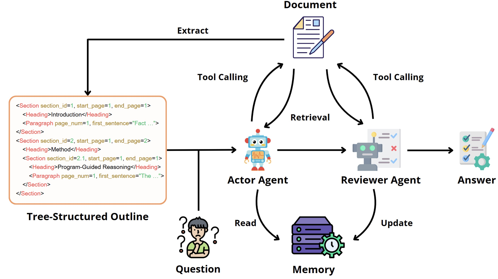

# DocAgent

Official Python implementation for paper *DocAgent: An Agentic Framework for Multi-Modal Long-Context Document Understanding*, accepted by *EMNLP 2025*.

### [[Paper & Supplementary Material](https://aclanthology.org/2025.emnlp-main.893.pdf)]
<p align="center">
  
</p>

### Abstract
Recent advances in large language models (LLMs) have demonstrated significant promise in document understanding and question-answering. Despite the progress, existing approaches can only process short documents due to limited context length or fail to fully leverage multi-modal information. In this work, we introduce DocAgent, a multi-agent framework for long-context document understanding that imitates human reading practice. Specifically, we first extract a structured, tree-formatted outline from documents to help agents identify relevant sections efficiently. Further, we develop an interactive reading interface that enables agents to query and retrieve various types of content dynamically. To ensure answer reliability, we introduce a reviewer agent that cross-checks responses using complementary sources and maintains a task-agnostic memory bank to facilitate knowledge sharing across tasks. We evaluate our method on two long-context document understanding benchmarks, where it bridges the gap to human-level performance by surpassing competitive baselines, while maintaining a short context length.


### Requirements

```Shell
pip install pdfservices-sdk openpyxl pandas PyMuPDF openai pillow python-dotenv
```

### Configuration
Create a `.env` file in the root directory and add your API keys:
```env
ADOBE_CLIENT_ID=your_adobe_client_id
ADOBE_CLIENT_SECRET=your_adobe_client_secret
DEEPSEEK_API_KEY=your_deepseek_api_key
```

### Data Pre-Processing
Prerequisite: Obtain free Adobe PDF Service Client ID and Secret from [here](https://acrobatservices.adobe.com/dc-integration-creation-app-cdn/main.html?api=pdf-services-api).

#### Option 1: General Preprocessing Pipeline
The preprocessing pipeline consists of 4 steps:
```bash
cd preprocess

# Step 1: Adobe PDF Structured Extraction
# Extract PDF content into intermediate XML format
python 1_run_pdf_extract.py --raw-data-dir ../data/ --result-dir ./extract_output/

# Step 2: Title Enhancement and Correction (OCR or Vision)
# Process extracted data and enhance title detection using OCR or Vision models
python 2_process_extracted_data.py --extract-data-dir ./extract_output/ --save-dir ./processed_output/

# Step 3: Generate Page Images (Optional)
# Create page images for vision-based agents
python 3_make_page_images.py --raw-data-dir ../data/ --save-dir ./processed_output/

# Step 4: Build XML Tree Structure
# Construct hierarchical XML tree from processed data for agent review
python 4_build_xml_tree.py --processed-dir ./processed_output/ --output-dir ../sample_results/
```

#### Option 2: Preprocessing for bylw-pgy Dataset

##### Method 1: Automated Pipeline Script (Windows PowerShell)
```powershell
.\scripts\run_pipeline.ps1 -DocName "bylw-pgy"
```

##### Method 2: Step-by-Step Execution
```bash
# Step 1: PDF Content Extraction (MinerU API)
python preprocess/1_run_pdf_extract.py --raw-data-dir ./data --result-dir preprocess/extract_output --doc-id bylw-pgy

# Step 2: Data Processing and Format Conversion
python preprocess/2_process_extracted_data.py --extract-data-dir preprocess/extract_output/MinerU --save-dir preprocess/processed_output/MinerU --doc-id bylw-pgy

# Step 3: Generate Page Images (Optional)
python preprocess/3_make_page_images.py --raw-data-dir ./data/bylw-pgy --save-dir preprocess/processed_output/MinerU --resolution 144

# Step 4: Build XML Tree Structure
python preprocess/4_build_xml_tree.py --processed-dir preprocess/processed_output/MinerU --doc-id bylw-pgy --output-dir sample_results
```

### Run DocAgent

#### Option 1: Run Full Experiment Pipeline
```bash
python ./run_experiment.py --preprocessed-data-dir ./preprocess/processed_output/ \
                           --save-dir ./sample_results/
```

#### Option 2: Run Single Document Review
```bash
python review_runner.py --doc-id your_doc_id
```

#### Option 3: Use Automated Pipeline Script (Windows PowerShell)
```powershell
.\scripts\run_pipeline.ps1 -DocName your_doc_id
```

### View Results
After running DocAgent, results are saved in the `sample_results/` directory:
- `review_[doc_id].json`: Detailed review results with issues and page numbers
- `report_[doc_id].html`: Interactive HTML report for visualization
- `outline_[doc_id].xml`: Extracted document outline structure
- `tree_[doc_id].xml`: Complete hierarchical XML tree

## Troubleshooting

1. **Adobe API Error**: Ensure Adobe credentials are valid and monthly free quota (1000 pages) hasn't been exceeded.
2. **OCR Model Download**: First-time OCR usage will download models automatically - ensure stable internet connection.
3. **Memory Issues**: For large PDFs, limit OCR processing pages using `--ocr-max-pages` parameter.
4. **Missing Dependencies**: Install optional OCR dependencies if using title correction features:
   ```bash
   pip install paddlepaddle paddleocr  # CPU version
   # or
   pip install paddlepaddle-gpu paddleocr  # GPU version (recommended)
   ```

### Citation

```
@inproceedings{sun-etal-2025-docagent,
    title = "{D}oc{A}gent: An Agentic Framework for Multi-Modal Long-Context Document Understanding",
    author = "Sun, Li  and
      He, Liu  and
      Jia, Shuyue  and
      He, Yangfan  and
      You, Chenyu",
    editor = "Christodoulopoulos, Christos  and
      Chakraborty, Tanmoy  and
      Rose, Carolyn  and
      Peng, Violet",
    booktitle = "Proceedings of the 2025 Conference on Empirical Methods in Natural Language Processing",
    month = nov,
    year = "2025",
    address = "Suzhou, China",
    publisher = "Association for Computational Linguistics",
    url = "https://aclanthology.org/2025.emnlp-main.893/",
    pages = "17712--17727"
}
```